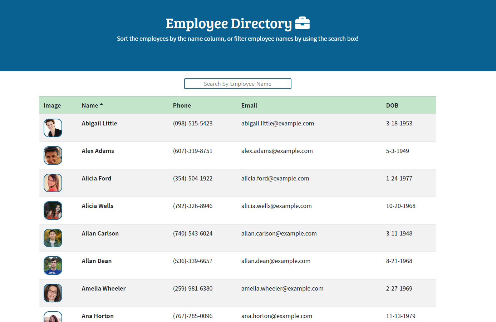
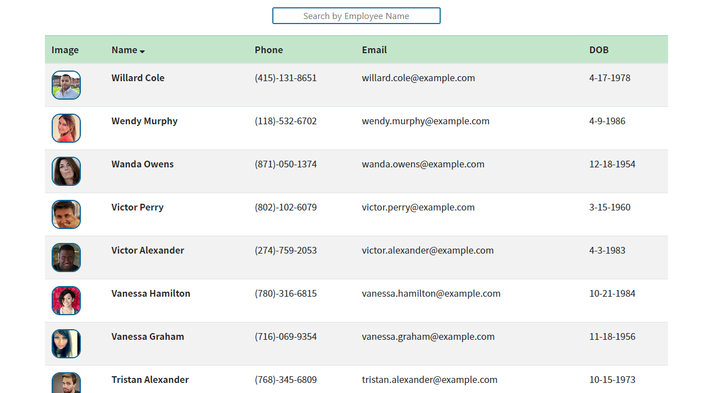
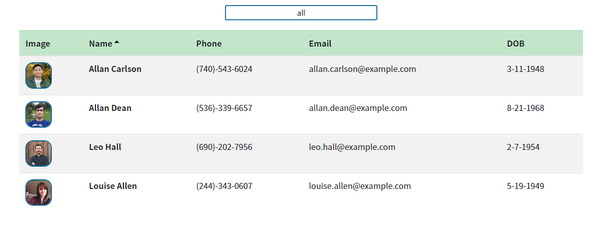
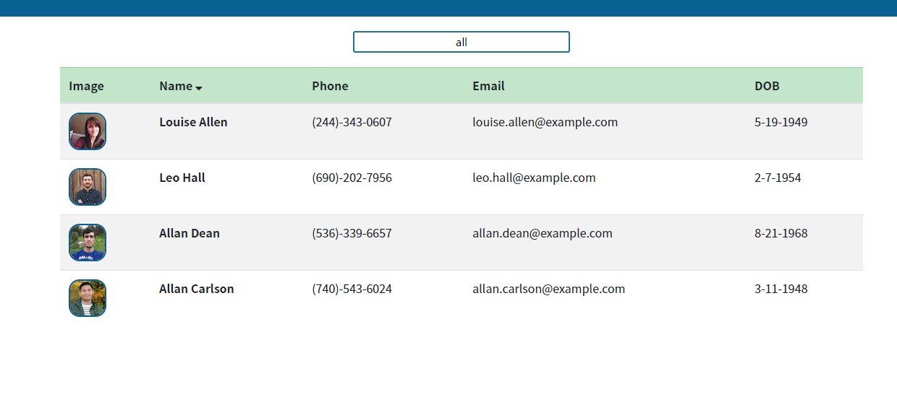

# Employee Directory 💼

***
<p align="center">
  
  
</p>

[](https://opensource.org/licenses/MIT)



## Table of Contents
* [Description](#description)
* [Installation](#installation)
* [Usage](#usage)
* [Questions](#questions)
* [License](#license)

<br>

## Description
Employee Directory is an app built using React.  The user will be able to see a list of employees, sort the name column by first name, and search for a specific employee.  

Feel free to check out the website [here](https://christina2021.github.io/employee-directory/)
<br>

## Installation
Please see the following command needed in order to use this application:<br>
```bash
npm i
npm start
```
This application will require Node.js.  Please make sure this is installed.


## Usage
Please see the following instructions on how to use this application: <br>
⭐ Once the webpage has been open, the name column will automatically be sorted alphabetically (by first name then last name), but the user will be able to sort by reverse-alphabetical order by clicking on the arrow next to "Name" table header.<br>
<br>
⭐ The user may also sort by first and/or last name by using the search box above the table..<br>
<br>
⭐ The filtered names may also be sorted either alphabetically or reverse-alphabetically.<br>
<br>

## Questions?
Feel free to check out my github profile [here](https://github.com/Christina2021)!
Should you have any questions, you may reach me by e-mail at: <a href="mailto:codechristina2021@gmail.com">codechristina2021@gmail.com</a>!

## License
[MIT](https://choosealicense.com/licenses/mit/#)